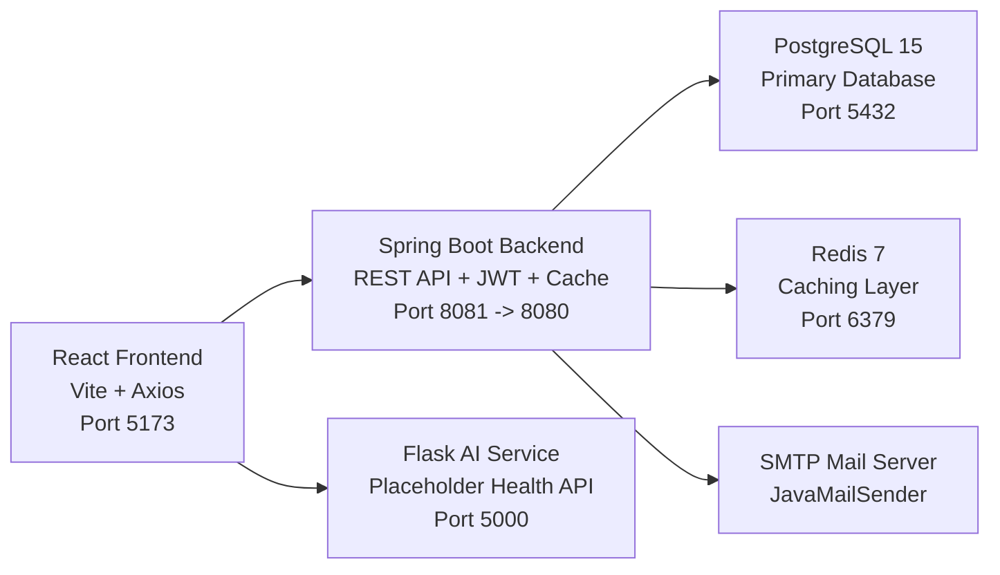

# Tool-87 Regulatory Deadline Countdown Widget

Regulatory Deadline Countdown Widget is a multi-service capstone project for tracking regulatory filings, reminders, status updates, and secured user access. The backend is built with Spring Boot, PostgreSQL, Redis, JWT security, scheduled email reminders, and Flyway migrations. The project also includes a Flask-based AI service placeholder and a React frontend dashboard.

## Overview

This project supports:

- secure login, register, and token refresh
- CRUD-ready deadline management backend
- Redis caching for read endpoints
- scheduled email reminders and deadline alerts
- Docker-based multi-service setup
- a branded frontend dashboard with skeletons, empty states, and an error boundary

## Architecture



## Tech Stack

- Java 17
- Spring Boot 3.3
- PostgreSQL 15
- Redis 7
- Flyway
- Spring Security + JWT
- JavaMailSender + Thymeleaf
- Python 3.11 + Flask
- React 18 + Vite
- Tailwind CSS
- Docker Compose

## Project Structure

```text
regulatory-deadline-countdown-widget/
|-- backend/
|-- ai-service/
|-- frontend/
|-- docker-compose.yml
|-- .env.example
|-- README.md
```

## Prerequisites

Before running the project, install:

- Java 17
- Maven 3.9+
- Node.js 20+ and npm
- Python 3.11
- Docker Desktop with Docker Compose

## Setup Steps

### 1. Clone the repository

```powershell
git clone <your-repository-url>
cd regulatory-deadline-countdown-widget
```

### 2. Create environment values

Copy `.env.example` and update values as needed.

```powershell
copy .env.example .env
```

### 3. Run with Docker Compose

This is the recommended setup for running all services together.

```powershell
docker compose up --build
```

Services:

- Frontend: `http://localhost:5173`
- Backend API: `http://localhost:8081`
- Swagger UI: `http://localhost:8081/swagger-ui.html`
- AI service: `http://localhost:5000`
- PostgreSQL: `localhost:5432`
- Redis: `localhost:6379`

### 4. Run backend locally without Docker

```powershell
cd backend
mvn spring-boot:run
```

### 5. Run frontend locally without Docker

```powershell
cd frontend
npm install
npm run dev
```

### 6. Run AI service locally without Docker

```powershell
cd ai-service
pip install -r requirements.txt
python app.py
```

## Default Seeded Users

The backend seeder creates the following users:

- `admin@tool87.com` / `Password@123`
- `manager@tool87.com` / `Password@123`
- `user@tool87.com` / `Password@123`

The seeder also creates 30 sample regulatory deadline records.

## .env Reference

| Variable | Purpose | Example |
|---|---|---|
| `SERVER_PORT` | Spring Boot internal server port | `8080` |
| `DB_HOST` | PostgreSQL host | `localhost` |
| `DB_PORT` | PostgreSQL port | `5432` |
| `DB_NAME` | PostgreSQL database name | `tool87` |
| `DB_USERNAME` | PostgreSQL username | `postgres` |
| `DB_PASSWORD` | PostgreSQL password | `your_postgres_password` |
| `REDIS_HOST` | Redis host | `localhost` |
| `REDIS_PORT` | Redis port | `6379` |
| `REDIS_PASSWORD` | Redis password if used | `` |
| `MAIL_HOST` | SMTP host | `smtp.gmail.com` |
| `MAIL_PORT` | SMTP port | `587` |
| `MAIL_USERNAME` | SMTP username | `your_email@example.com` |
| `MAIL_PASSWORD` | SMTP app password | `your_email_app_password` |
| `MAIL_SMTP_AUTH` | Enable SMTP auth | `true` |
| `MAIL_SMTP_STARTTLS_ENABLE` | Enable STARTTLS | `true` |
| `JWT_SECRET` | Secret used for JWT signing | `replace_with_a_secure_secret` |
| `JWT_ACCESS_TOKEN_EXPIRATION_MS` | Access token lifetime in ms | `900000` |
| `JWT_REFRESH_TOKEN_EXPIRATION_MS` | Refresh token lifetime in ms | `604800000` |
| `CORS_ALLOWED_ORIGINS` | Allowed frontend origins | `http://localhost,http://localhost:5173` |
| `FRONTEND_URL` | Frontend base URL | `http://localhost` |
| `SECURITY_LOG_LEVEL` | Spring Security log level | `INFO` |
| `SQL_LOG_LEVEL` | Hibernate SQL log level | `INFO` |

## Main Backend Features

- JWT authentication with register, login, and refresh endpoints
- JPA entity and repository layer for regulatory deadlines
- service layer validation and custom exception handling
- global JSON error handling with `@ControllerAdvice`
- Redis caching with cache eviction on write operations
- role-based access control using `@PreAuthorize`
- scheduled email reminders and deadline alerts
- Docker-based integration setup

## Testing

Backend tests:

```powershell
cd backend
mvn test
```

Frontend production build:

```powershell
cd frontend
npm run build
```

## API Highlights

- `POST /api/v1/auth/register`
- `POST /api/v1/auth/login`
- `POST /api/v1/auth/refresh`
- `GET /api/v1/deadlines/all`
- `GET /api/v1/deadlines/{id}`
- `POST /api/v1/deadlines/create`

## Notes

- Backend container is exposed on host port `8081` to avoid local `8080` conflicts.
- The current AI service is a placeholder health service and can be extended later.
